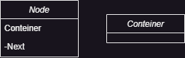
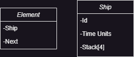
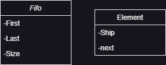
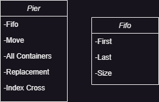
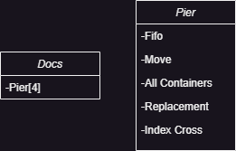

# Port Simulator

.png)

### Introdução

O trabalho tem como objetivo a implementação de
um simulador portuário em linguagem C, que visa
reproduzir e simular operações portuárias de um porto
fictício inspirado no Terminal de Puerto Nuevo,
localizado em Buenos Aires, Argentina.

O simulador de porto será desenvolvido com base em
um modelo de simulação conceitual, com foco no processo
de carregamento de contêineres. Serão considerados
diferentes cenários para a modelagem e implementação
do simulador, a fim de abranger as principais etapas
e elementos envolvidos nas operações portuárias.

No contexto do simulador, um terminal de contêineres
é representado como uma área aberta em um ancoradouro,
onde os navios chegam e ancoram em filas para permitir
o descarregamento de contêineres. O objetivo é simular o
fluxo de contêineres, desde a chegada do navio ao porto
até o seu transporte para o pátio de armazenamento.

Durante o processo de simulação, serão consideradas
diversas atividades que ocorrem em um terminal de
contêineres, tais como a chegada do navio ao porto,
o descarregamento de contêineres, e o transporte até
o patio.

O simulador de porto terá como base um pequeno porto
com quatro áreas de atracamento numeradas de 1 a 4.
Cada área de atracamento contará com uma grua que irão
descarregar os navios e empilhar os contêineres nas travessas.

O simulador de porto será contolado por unidades de
tempo, permitindo o avanço do processo em etapas.
A cada unidade de tempo novos navios poderão chegar,
às filas de atracamento, sendo atríbuidos identificadores
e quantidades aleatórias de contêineres.

A saída do simulador fornecerá informações detalhadas
sobre o estado do porto a cada unidade de tempo, facilitando
a compreensão e análise dos resultados. O objetivo é
criar um simulador eficiente e autoexplicativo, que
reproduza com fidelidade as operações portuárias e
permita a visualização do fluxo de contêineres.

No próximo tópico, serão apresentados os detalhes
do trabalho incluindo os processos envolvidos e as regras
de funcionamento do simulador de porto em linguagem C.

### Requisitos do Sistema

* Sistema Operacional Windows;
* Compilador C;

### Instalação

Para obter o código-fonte mais recente do Port Simulator,
você pode clonar o repositório Git. Siga as etapas 
abaixo para realizar a clonagem:

1. Abra o terminal ou prompt de comando.
2. Navegue até o diretório onde você deseja 
clonar o projeto.

   `cd /caminho/para/sua/pasta/`
3. Agora, clone o repositório Git executando o 
seguinte comando:
`git clone https://github.com/Joao-Lamounier/port-simulator.git`
4. Aguarde até que o Git termine de clonar o 
repositório. Você verá mensagens indicando o progresso da clonagem.

Após a conclusão dessas etapas, você terá o 
código-fonte do Port Simulator clonado em seu 
diretório local. Agora você pode prosseguir com as 
etapas de configuração e compilação conforme descrito
na documentação.
### Arquitetura e Design
O Port Simulator é projetado com arquitetura em camadas,
com o objetivo de promover uma separação clara das
responsabilidades e facilitar a manutenção e extensibilidade
do sistema. A arquitetura é composta por duas camadas
principais interface de usuário e lógica do negocio.

* Interface de usuário: A camada de interface de usuário
é responsável por fornecer uma interface interativa, para
que os usuários possam interagir com o Port Simulator.
Essa camada inclui o menu inicial e apresentação do
processo que ocorre no porto.

* Lógica de negócio:A camada de lógica de negócio 
é o coração do simulador de porto. Ela contém a lógica
principal para simular as operações do porto, como a
chegada de navios, movimentação de contêineres e
alocação de recursos. Essa camada é implementada
em um conjunto de módulos interconectados, cada um com 
responsabilidades específicas.

### Funcionalidades
* Chegada de saída de navios: O gerenciamento dos navios, que irão
partir quando descarregados, e chegarão de 0 à 3 navios por unidade
de tempo.
* Situação das travessas: Permitir a visualização das travessas em
tempo real, quantos contêineres possuem e quando serão levadas para 
serem esvaziadas
* Cálculo de tempo de espera: Calcular o tempo de espera 
dos navios para atracação com base na quantidade de contêineres
à serem descarregados.
* Movimentação dos veículos: Diz quantas vezes cada veículo saiu para
esvaziar alguma das travessas.

### Estrutura de Dados
* Contêiner
    
   
  * Criar novos contêineres;
  

* Node 

  
  *  Criar um novo Node;
    

* Pilha

  
  * Criar uma nova pilha;
  * Empilhar um node;
  * Empilhar 'n' nodes;
  * Desempilhar um node;
  * Desempilhar a pilha toda;
  * Verificar pilha vazia;

* Ship

   
  * Criar um novo navio;
  * Verificar se o navio foi descarregado;
  * Somatório de todos os contêineres do navio;

* Element 

  
  * Criar um novo elemento;

* Fifo

  
  * Criar uma nova fila;
  * Enfileirar um elemento à fila;
  * Desenfileirar um elemento à fila;
  * Verificar se a fila está vazia;
  

* Pier 

    
  * Criar um novo cais;
  

* Docs
  
    
  * Criar um novo conjunto de cais;

* Crossbeam 

   
  * Criar uma nova travessa;
  * Verificar se a travessa disponível;
  * Verificar se uma travessa está cheia;
  * Verificar se a travessa está vazia

* Crossbeam Collection

  
  * Criar uma nova coleção de travessas;

### Algoritmos
* Escalonamento de filas: Esse algoritmo é responsável
por equilibrar o tamanho das filas, inserindo sempre
na menor fila, assim, a maior diferença entre as filas
será sempre de um navio.
* Escalonamento de travessas: Este escalonamento
não atrela a travessa ao cais fixamente, porém
quando uma travessa é designada à um cais ela só
corresponde a ele, quando encher poderá ser atribuida
a um novo cais.

### Compilação e Execução

* Abra um terminal no diretório raiz do projeto.
* Execute o seguinte comando para compilar e executar o programa.

    make port-simulator

### Limitações e Possíveis Melhorias
O Port Simulator não perssiste dados em memória, 
isso impede o salvamento e restauração do estado
do simulador. Além disso, se o programa for 
encerrado abruptamente, todas as informações 
serão perdidas, o que pode ser inconveniente e 
frustrante para os usuários.

### Conclusão
  O trabalho foi realizado com o intuito de representar
como ocorre o processo interno de um porto 
  fictício, construir um simulador portuário em 
linguagem C foi empolgante e enriquecedor. O projeto
permitiu praticar os conceitos primordiais da programação, 
como a aplicação de algoritmos e diversas estruturas
de dados.

  Durante o desenvolvimento do simulador, pude 
compreender melhor as operações internas de um
  porto e como trazer esses conceitos para a 
programação. 

  Ao longo do desenvolvimento, foram utilizados
conceitos como filas para representar a chegada
de navios e pilhas para representar as movimentações
de contêiners.

Embora este simulador de porto esteja funcional
e ofereça uma visão geral das operações portuárias
, reconheço que existem áreas em que o projeto 
poderia ser aprimorado. Por exemplo, poderiam ser
adicionadas mais funcionalidades, como a persistência
de dados em memória.

No geral, este projeto me proporcionou um valioso
aprendizado sobre aplicação de estrutura de dados
em problemas reais.

Autor: João Felipe Silva Lamounier.

   
